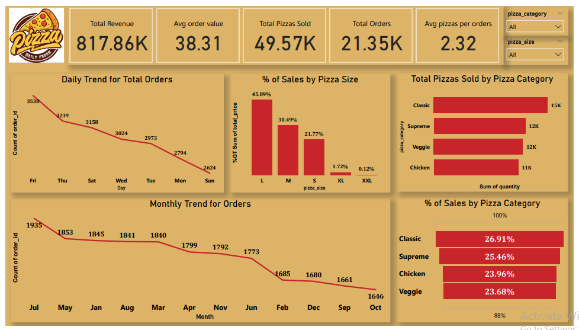

# Pizza-Sales-Data-Analysis
This interactive Power BI dashboard provides key insights into pizza sales using SQL-based metrics. It highlights order trends, pizza size and category performance, and helps identify peak sales periods and customer preferences.

## 🛠 Tools Used
- SQL (Data Extraction)
- Power BI (Dashboard Design & Data Visualization)

## 🧾 Objective
This dashboard provides a detailed view of pizza sales performance across different sizes, categories, and time frames. It helps identify top-performing pizza types, sales trends, and customer behavior throughout the week and year.

## ⚙️ Data Preparation
- Used **basic SQL queries** to extract summary statistics (e.g., total revenue, average order value, total orders).
- Worked on a **single clean table** without complex joins.
- Generated key metrics directly from the database, which were later visualized in Power BI.

## 📊 Key Metrics
- **Total Revenue:** 817.86K  
- **Average Order Value:** 38.31  
- **Total Pizzas Sold:** 49.57K  
- **Total Orders:** 21.35K  
- **Avg Pizzas per Order:** 2.32  

## 📈 Analysis Highlights

### 📅 Daily Trend for Orders
- Sales peak on **Fridays (3538 orders)** and drop steadily through the week.
- **Sunday** shows the lowest order volume (2624), indicating a weekly sales cycle.

### 🗓️ Monthly Trend for Orders
- Highest monthly orders in **July (1935)**, with a gradual decline until **October (1646)**.

### 🍕 Sales by Pizza Size
- **Large (L)** pizzas dominate with **45.89%** of total revenue.
- **Medium (M)** follows with **30.49%**, while **XL & XXL** sizes contribute the least.

### 🍽️ Pizza Category Insights
- **Classic pizzas** lead both in quantity sold (15K) and revenue contribution (26.91%).
- Other categories: Supreme, Chicken, and Veggie perform relatively close.

## 🧠 Insights & Takeaways
- Large size pizzas are the most profitable.
- Fridays are the best sales days, while Sundays are the lowest.
- The top category by volume and revenue is Classic pizzas.
- Monthly sales show a slight decline, suggesting seasonal effects or marketing opportunities.

## 📷 Report Preview

